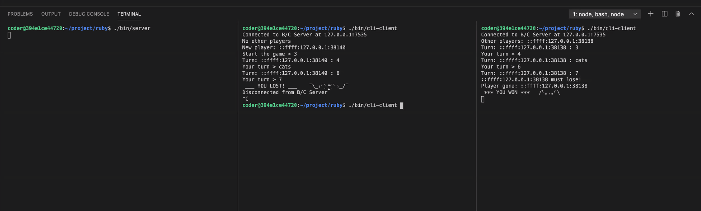
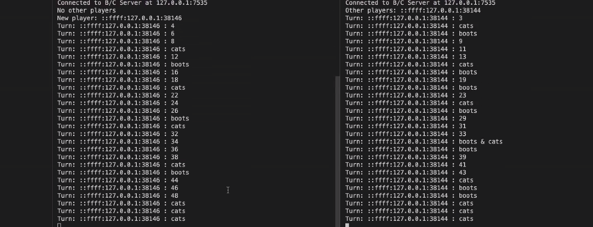
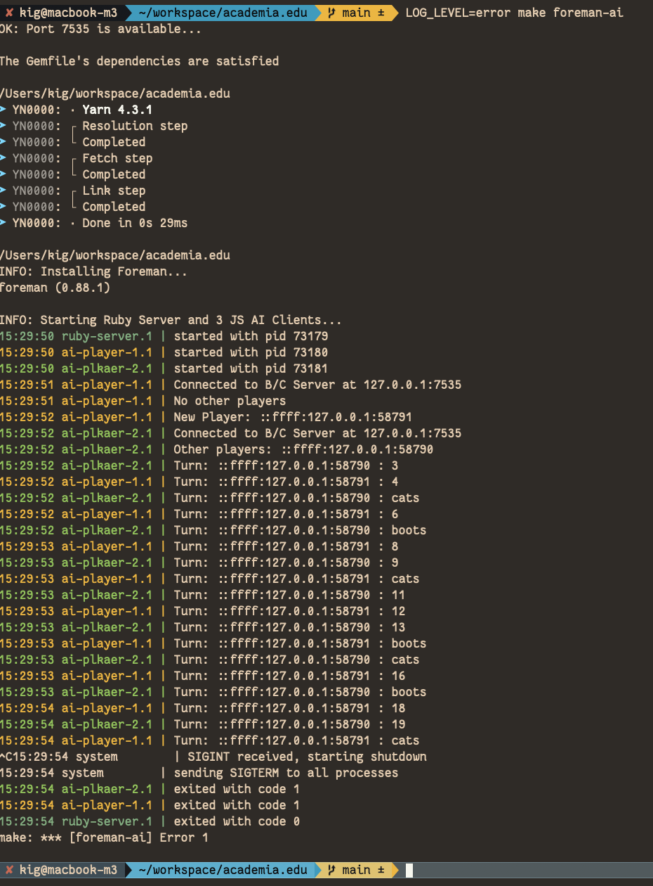

# Network Game — Boots & Cats

[](https://github.com/kigster/number-counting/actions/workflows/rspec.yml)
[](https://github.com/kigster/number-counting/actions/workflows/rubocop.yml)

## Game Definition

There has been a NodeJS Server and JS Clients written to allow console-based play of the Boots and Cats game, which goes as follows:

* The game starts as soon as at least two players connected.
* The first player is then prompted to enter a starting number.
* Each subsequent player is then required to enter the next number in sequence, except for the cases when 
  * that number is either divisible by 5 or contains the digit 5, in which case the player must say "cats"
  * or the number is divisible by 7 or contains the digit 7, in which case the player must say "boots".
  * Finally, if the number satisfies both conditions, the player must say "boots and cats".
  * We will call such words that replace a number **"a mapping"**.
* If the player says the wrong number, or the wrong mapping, the play instantly loses the game, and as long as there are at least two players remaining the game continues.
* Players may join or leave at any point in time.
* If only one player is remaining (either because others left, or lost by saying the wrong word), the remaining player _wins the game_.

## Problem Definition

The client-side of the game play written in JS/NodeJS remains and is functional, however, the server for the game had been lost, and only the binary remains.

The task is to reverse-engineer the server and implement it in Ruby.

## Examples

Here are a couple of screenshots showing of the game in action:

### Manual Clients (aka `cli-client`)

<p><a href="doc/boots-cats-js-client.png"></a></p>

### AI Clients (aka `cli-client`)

<p><a href="doc/boots-cats-ai-client.png"></a></p>

# Solution

Current Ruby Server works as expected. The only unimplemented feature currently is the timeout.

Here is an example session between two AI clients:

<p><a href="doc/ai-play.png"></a></p>

## Makefile

There is a top-level `Makefile` that offers several convenient shortcuts.

To see available commands, run:

```bash
❯ make
```

```
build         Install Ruby and JS dependencies and run the all the tests and linters
check-port    Verifies that nobody is already attached to the server's port
foreman-ai    Use Foreman to start a server + several AI clients
help          Prints help message auto-generated from the comments.
iterm-ai      Use AppleScript & iTerm2 to start a server + several AI clients
iterm-cli     Use AppleScript & iTerm2 to start a server + several CLI clients
js-install    Setup the JS clients
ruby-all      Installs Ruby Gems, runs RSpec and Rubocop.
ruby-install  Setup the Ruby Server
ruby-lint     Run ruby checks such as rubocop
ruby-lint-fix Auto-fix with Rubocop all fixable errors and regenerate auto-config-file
ruby-rspec    Runs the Ruby RSpec tests for the server
```
  
## Running the Server and Clients

There are two ways you can start both the server and the clients.

### Logging Level on the Server

The server process uses Ruby Logger class to log messages to `STDOUT`. To emulate the silent NodeJS server, set the `LOG_LEVEL=error` before running the ruby server, and will be completely quiet.

For example:

```bash
LOG_LEVEL=error make foreman-ai
```

### 1. Running the Manually

First execute the setup:

```bash
make build
```

Then open 3 windows:

 1. In the first window run `cd boots-cats-ruby && LOG_LEVEL=debug ./bin/server`
 2. In the second window run `cd boots-cats-js  && ./bin/cli-client`
 3. In the second window run `cd boots-cats-js  && ./bin/cli-client`

And so on.

To run AI clients, replace `cli-client` with `ai-client`.

If you don't want to see packets sent to the client by the server, reduce log level to `info`: 

```bash
# No logging
LOG_LEVEL=error ./bin/server

# Minimal logging
LOG_LEVEL=info  ./bin/server

# Debug logging, includes network packages sent to all clients
LOG_LEVEL=debug ./bin/server
```

### 2. Using Foreman to run AI Clients

This method works on all operating systems, and uses the `Procfile.ai` to start the server and the AI clients. 

However, when using Foreman, all processes will appear in a single window, and may be difficult to debug.

### 3. Using iTerm2 and ApppleScript to run either AI or CLI Clients.

Because Foreman does not make it easy for a sub-process to receive input from STDIN, we do not offer a way
to start CLI clients via Foreman. Instead, we offer two methods that are more flexible, that use AppleScript to drive iTerm2 to open a new window, split it into panels, and run a specific command in each panel.

If you have iTerm2 on OS-X installed, you should be able to use the commands:

```bash
# Start a new iTerm2 window, with multiple panels dedicated to the server
# and the AI clients.
❯ make iterm-ai
# OR

# Start a new iTerm2 window, with multiple panels dedicated to the server
# and the CLI clients.
❯ make iterm-cli
```

This should start a new iTerm2 window, and split it into panes where the bottom pane is the server, and the middle-top and right-top are the clients. The left-most top panel is the open shell prompt.

# Copyright

* The Problem Definition: © 2024 Academia.edu, All Rights Reserved. 
* The Solution © 2024 Konstantin Gredeskoul, All Rights Reserved.

